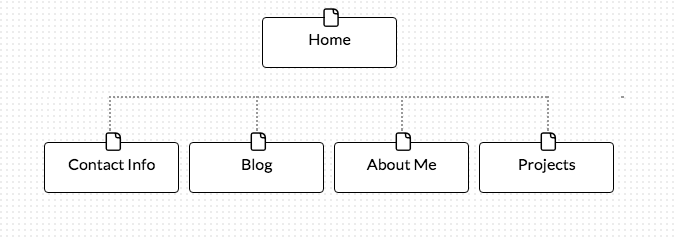

1. What are the 6 Phases of Web Design?
  1. Information Gathering
  2. Planning
  3. Design
  4. Development
  5. Testing and Delivery
  6. Maintenance
2. What is your site's primary goal or purpose? What kind of content will your site feature?
  * This will become my personal website, so that others can see what kinds of projects I am currently working on. In addition people should be able to follow the things that I decide to blog about.
3. What is your target audience's interests and how do you see your site addressing them?
  * I would have to say that my target audience, are those that are interested in Systems Administration topics, and those who are interested on what I am working on.
4. What is the primary "action" the user should take when coming to your site? Do you want them to search for information, contact you, or see your portfolio? It's ok to have several actions at once, or different actions for different kinds of visitors.
  * I feel that the primary action of the website is to see my "bio" or about me page
  * I beleieve that the website should be planned out in a way that if they are looking to find my contact info. One should not have to search to find the info.
  * I feel that there are going to be different types of vistors to my website, those that want to know what I am doing on a professional level and those that want to know what I am doing on a personal level, ie hobbies and what not. However I think this info would be part of a blog, so if I use the correct tag when labeling the post. I feel it should be easy for people to find what they think is interesting.
5. What are the main things someone should know about design and user experience?
  * Having a good design with out it being usable is a real problem. For example, having a link that points to the wrong place. Who cares if its pretty, but it doesn't work correctly or its too difficult to navigate. This is where UX comes in. UX is the study of what people gravitate towards and click on.
6. What is user experience design and why is it valuable?
  * User experience design is designing with the user in mind. After all the people that are using my website or users. I want people to be able to get what they are looking for on my website so that they stay engaged. While it might not be feasible to hire a UX researcher. Many can benefit from the efforts of user experience design.

Which parts of the challenge did you find tedious?
 * It appears that I still have lots of markdown to learn. I think the most tedious part was figuring out what I wanted my sitemap to look like.
