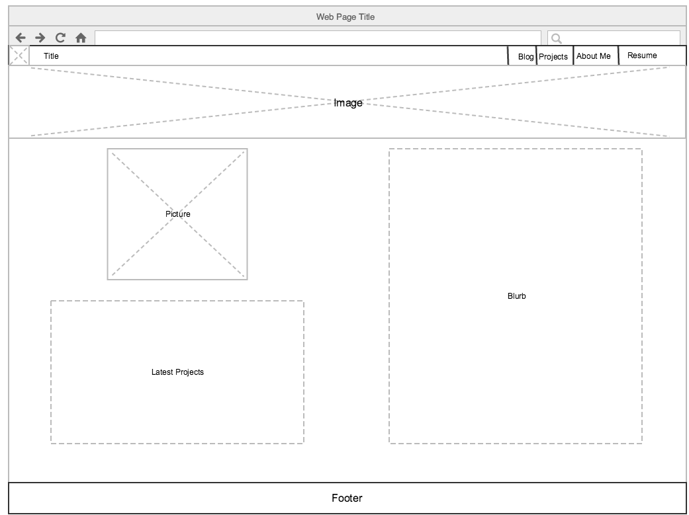
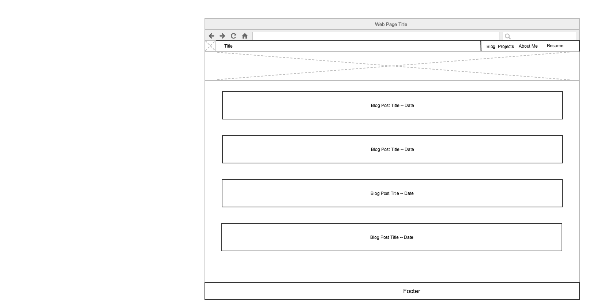

# Reflection
- What is a wireframe?
  - A wireframe is like a blueprint. It  plays as a  basic mock up of what a page would look like.
- What are the benefits of wireframing?
  - Wireframes are a quick way to show what your intentions are for a website. It helps define the layout so that when you go to actually start implementing the website the layout is already defined.
- Did you enjoy wireframing your site?
  - I did enjoy wireframing my website.
- Did you revise your wireframe or stick with your first idea?
  - I made serveral changes to my wireframe. Once I created the first wireframe. I realized I didn't like the porportions that I orginially chose.
- What questions did you ask during this challenge? What resources did you find to help you answer them?
  - I did not really ask a whole lot of questions. I ended up going to other sites to get insperation on what I thought would look good visually.
- Which parts of the challenge did you enjoy and which parts did you find tedious?
  - The Tedius: Fighting with the wireframing software to get everything in the place I wanted.
  - Enjoy: Looking at different websites for insperation. Finding something that I was happy with in the end.

# Wireframes
- Index Wireframe

- Blog Index Wireframe

