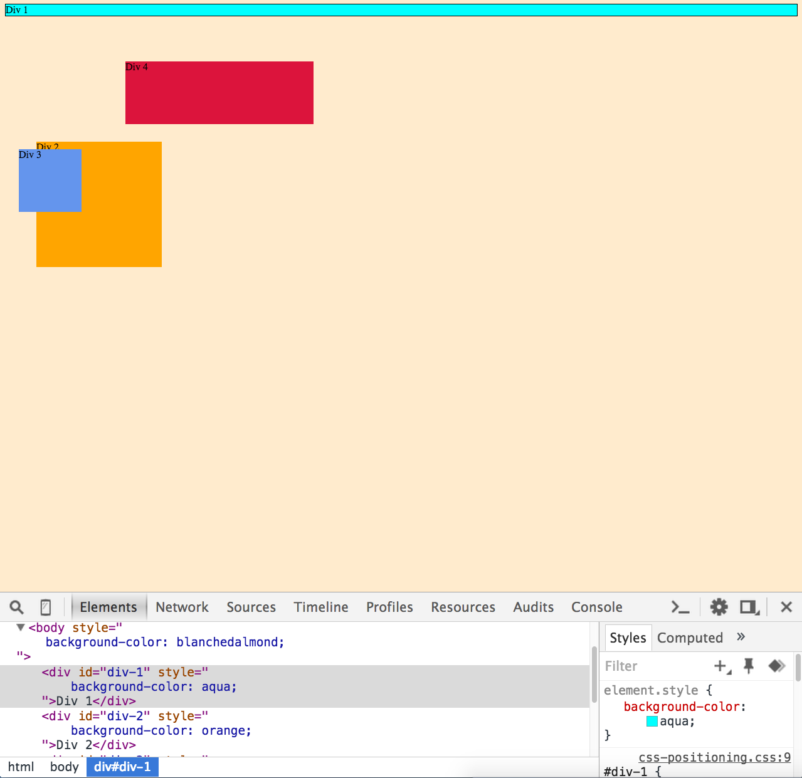
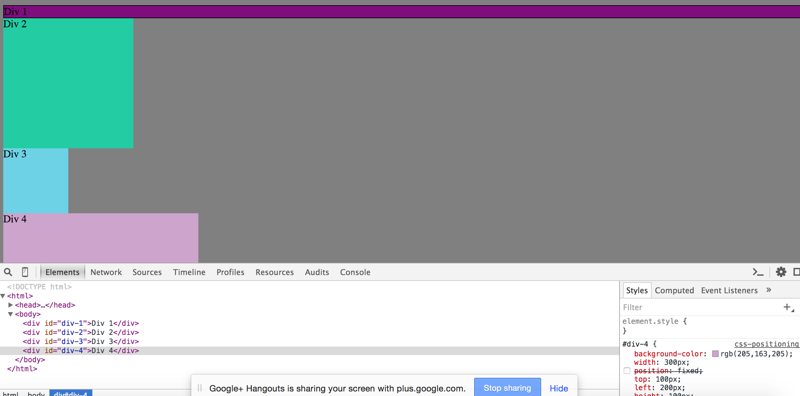
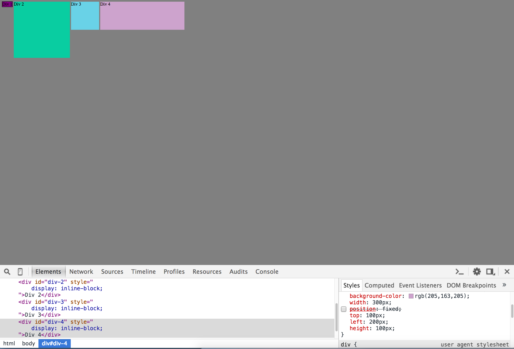
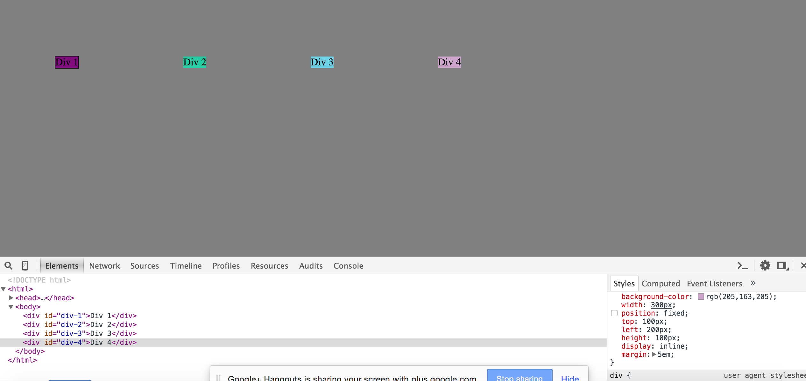
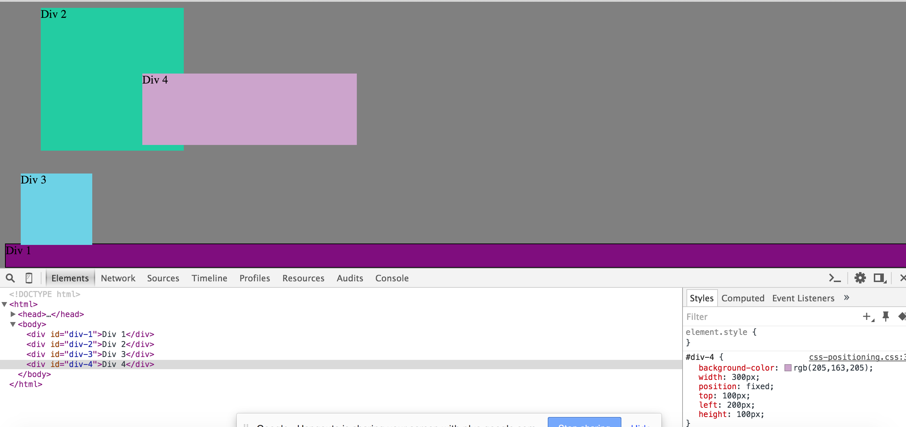
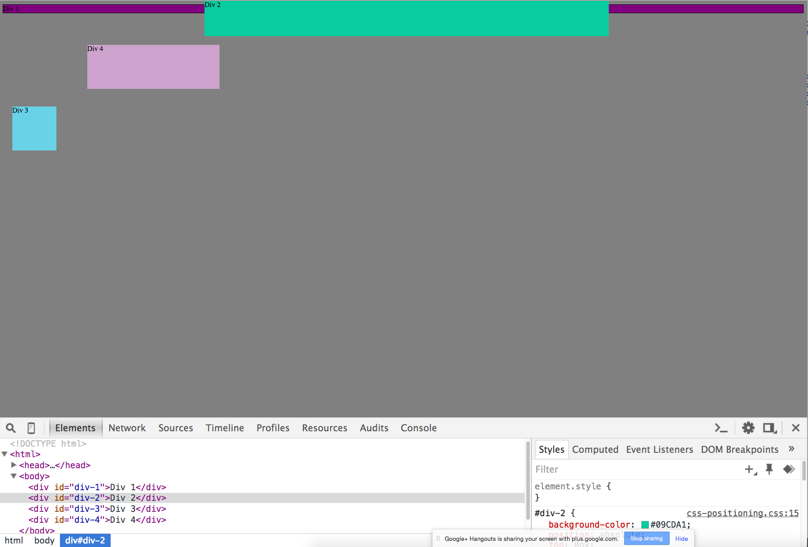
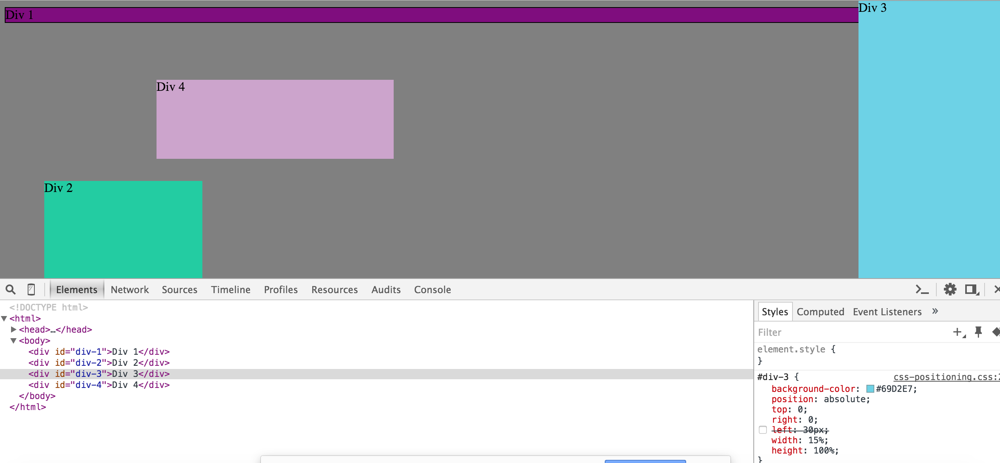
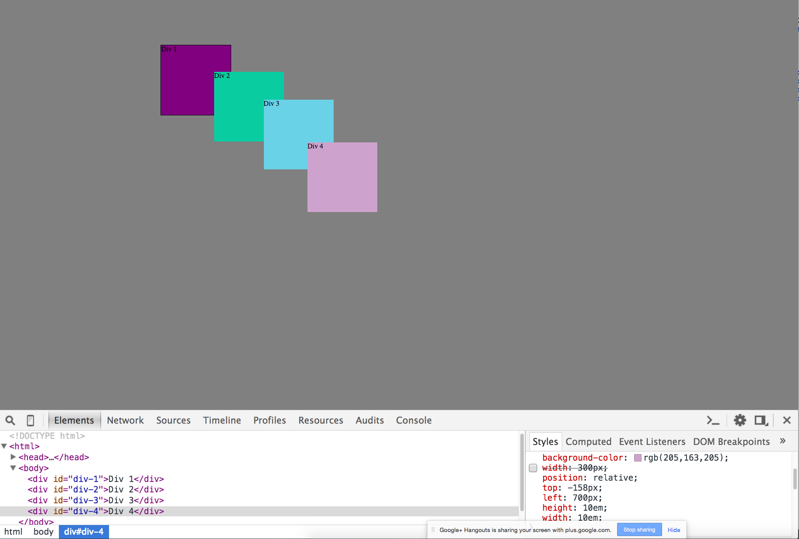

# Reflection
  * How can you use Chrome's DevTools inspector to help you format or position elements?

    The Chrome DevTools are very powerful. The DevTools allows one to change the attributes assigned to a specific Document Object, "in place". When writing CSS it can be a hassle to have to switch back and forth between a browser and the editor. The Chrome DevTools allow of you to see changes as you make them. Chrome DevTools is also great for experimenting.

  * How can you resize elements on the DOM using CSS?

  One can change resize elements on the Dom by changing the attributes associated with the object. For example if you wanted to change the size of a block element, you can adjust the height and width of the object. If you wanted to change the size of some text, you can change that with the font-size attribute.
  * What are the differences between Absolute, Fixed, Static, and Relative positioning? Which did you find easiest to use? Which was most difficult?
    * Absolute: Absolute Positioning is where one can set the position to be a certain value regardless of the size of the window.For example if you want a footer to always be at the bottom of the page even if someone makes a window bigger or smaller.
    * Fixed: Fixed Positioning is a setting that places the element in a specific relationship to the size of the window at that instance in time.
    * Static: Static is the default value, It places the element where it would fall depending on the how the document is read.
    * Relative: Relative Positioning would add additional movement to where it would normally be placed on the page. For example if by default something on the page needs to be moved to the right 10 px one can do this by using the relative position tag.

  * What are the differences between Margin, Border, and Padding?

  Margin, Border and Padding are key properties that are used in correctly positioning your elements on a page. Margins are the space around elements that keeps, surrounding elements borders touching each other. Borders are what surrounds the content of the element plus the padding. Padding is the space between the border and the content of the element.

  * What was your impression of this challenge overall? (love, hate, and why?)

  I think that is very important challenge to understand as many other things will build on top of this. The Chrome DevTools are a great way to troubleshoot and experiment with the visual aspects of a page. As there are many ways to solve these Exercises, I wish we were told to use certain techniques to solve these. For example in this exercise do not use "blank" positioning. 

# Exercises
  1. Exercise 1
  
  2. Exercise 2
  
  3. Exercise 3
  
  4.  Exercise 4
  
  5. Exercise 5
  
  5. Exercise 6
  
  7. Exercise 7
  
  8. Exercise 8
  
  8. Exercise 9 
  