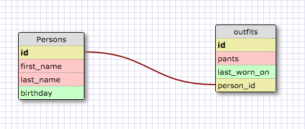

# Introduction to Databases

#### I worked on this challenge by myself
#### This challenge took me 1 hour.

## SQL Queries

Paste the correct SQL queries for each of the following:

1. Select all data for all states:

  `SELECT * FROM states;`
2. Select all data for the regions:

  `SELECT * FROM regions;`
3. Select the `state_name` and `population` for all states:

   `SELECT state_name,population FROM states;`
4. Select the `state_name` and `population` for all states ordered by population. The most populous state should be at the top:

  `SELECT state_name,population FROM states ORDER BY population DESC;`
5. Select the 'state_name's for the states in region 7:

  `SELECT state_name FROM states where region_id = 7;`
6. Select the 'state_names' and 'population_density' with a population density over 50 ordered from least to most dense:

  ```SELECT state_name, population_density FROM states
     WHERE population_density > 50
     ORDER BY population_density ASC;```

7. Select all state_names for states with a population between 1 million and 1.5 million people:

  `SELECT state_name FROM states WHERE population > 1000000 AND population < 1500000;`

8. Select all state_names and region_id ordered by region in ascending order:

  `SELECT state_name, region_id FROM states ORDER BY region_id ASC;`

9. Select the 'region_name' for the regions with "Central" in the name:

  `SELECT region_name FROM regions WHERE region_name LIKE "%CENTRAL%";`

10. Select all of the region names and the state names in ascending order by regional id:

  `SELECT regions.region_name,states.state_name FROM states INNER JOIN regions
  ON states.region_id=regions.id order by states.region_id ASC;`

## `persons` and `outfits` Schema
<!-- Include a link to your schema design here -->



## Reflection
1. What are databases for?
  * Databases are used as efficient ways to store persistent data. Databases allow for data to be structured in ways so that we can query and add additional information with ease.

2. What is a one-to-many relationship?
  * A one to many relationship is when where one entity, can have multiple entities belonging to it.For example a person can have 5 cars. This would be a one to many relationship.

3. What is a primary key? What is a foreign key? How can you determine which is which?

  * A primary key is a unique identifier for each record in a table.
  * A foreign key is a primary key that is being in used in another table.
  * A foreign key should be named appropriately so that one can tell whether its the primary key or the foreign key. For example the primary key will normally be id(or some other unique identifier). A foreign key can appear multiple times within a table.

4. How can you select information out of a SQL database? What are some general guidelines for that?
  * You can query a database using SELECT, it is recommended that you only ask for the data you need to get the answers you are looking for. For example using Select * when you need only one column is a bad thing to do.