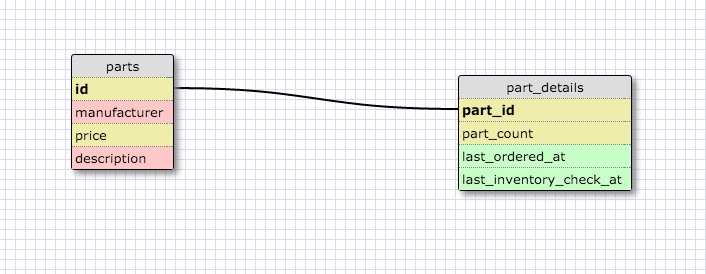
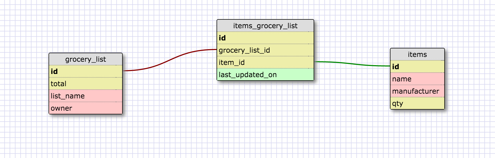

# More Schemas
## Release 2: Create a One-to-one Schema

* This is a one to one relationship because there is only one part_id. I chose to make this a one to one relationship because there are details that you want to keep track of but don't want to query that information every time you look for more general information about a part.

## Release 4: Create a Many-to-Many Schema

## Release 6:Reflect
1. What is a one-to-one database?
  * One should use a 1-1 relationship is where the primary key and the foreign key are exactly the same. The common use is when there are extra details about one field that are not always needed to be queried. The extra details can be stored in an different table which contains the 1:1 relationship.
3. What is a many-to-many database?
  * a many to many database is a database that contains entities that have a many to many relationship.
5. What is confusing about database schemas? What makes sense?
  * I think the most confusing thing about this is that we are being asked to model a database without any real context which makes it hard to ascertain the type of relationship. The other thing is that there are many different ways to make a schema, and it would be hard to say why one version is better than an other.